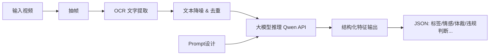

# 🎥 视频内容特征提取 Demo

*——面向短视频的内容分析原型系统*

> 本项目是一个端到端的视频内容理解 Demo，旨在快速验证 OCR + 大模型 Prompt 策略在内容特征提取（如分类、情感、低质识别等）中的可行性与效果，契合推荐系统、内容安全、AIGC 应用等场景。
🔍 **典型用途**：视频内容理解、自动生成摘要、视频检索、智能标签、智能推荐等。

---

## 📌 项目背景

为响应内容理解工程师岗位的核心职责（如设计特征提取方案、制定高效 Prompt 策略、结合业务快速迭代），我构建了此可扩展原型，验证以下能力：

- 从短视频中自动提取文本信息
- 利用大模型（Qwen）进行多维度内容理解
- 通过 Prompt 工程提升输出质量与结构化程度
- 支持快速接入新特征任务（如新增标签、体裁识别）
  
---

## 🛠️ 技术架构



### 核心组件

| 模块 | 技术选型 | 说明 
|:--------:|:--------:|:-------:|
| 视频抽帧 | OpenCV | 抽帧频率可以调节 | 
| OCR | PaddleOCR | 中文场景优化，高召回率 |
|文本预处理 | 正则+去重算法 | 过滤水印、重复字幕、无意义符号 |
|大模型调用 | 阿里Qwen-Max/Qwen-Plus API | 支持动态Prompt注入 |
|Prompt | Prompt选择 | 支持任务插拔式拓展 |

---

## 💬 Prompt 策略设计（核心亮点）

### 设计原则

- **角色设定**：明确模型身份（如“内容审核专家”）
- **输出约束**：强制 JSON Schema，便于程序解析
- **Few-shot 示例**：提供正/反例提升准确性
- **业务对齐**：将“低质内容”定义转化为可操作判断标准

**示例：视频内容审核 Prompt（优化版）**

```text

你是一个专业的短视频内容理解与审核模型。
你将基于视频中通过 OCR 提取的文字内容，对视频进行多维度分析。
你只能依据提供的文字内容进行分析，不得假设视频画面、声音、人物或场景。若文字不足以支撑某项判断，请降低置信度或标记为‘中性/未知’。

【背景说明】
- 以下文字按时间顺序提取自视频画面（包括字幕、标题、水印等）。
- 若某文本在连续时间段重复出现，通常表示其为核心信息或固定标识。
- 文本可能包含口语化表达、营销话术或不完整句子，请结合整体语境理解。

【判定参考】
- 低质内容包括：画面文字重复堆砌、无实质信息的营销话术、语义混乱、大量错别字、诱导互动（“不转不是中国人”）等。
- 违规风险包括：虚假宣传、医疗/金融误导、软色情暗示、政治敏感、侵犯隐私、引战歧视、违禁品推广等。
- summary_confidence基于文本完整性、关键信息清晰度及语义连贯性。若文字碎片化、缺失主语/动词/对象，或仅含口号式语句，置信度应低于 0.6。summary_confidence 仅反映“能否从文本中提炼出可靠摘要”，与其他维度（如风险、低质）解耦。
- 当存在模糊或潜在违规可能时，has_risk 应设为 true，并在原因中注明‘疑似…’

【视频文字时间轴】
{timeline_text}

【分析任务】
请严格按以下各项完成分析，并以 JSON 格式输出，不要任何额外说明：

1. summary: 用一句话概括视频主要内容
2. summary_confidence:给出摘要的置信度(0-1)
3. tags: 给出 3~5 个内容标签（字符串列表）
4. category 可选：新闻、娱乐、广告、教育、生活、科技、体育、财经、健康、其他
5. genre 可选：产品推广、事件报道、教程、Vlog、评论、快讯、剧情短片、直播切片、其他
6. tone: 整体调性（如 客观、煽情、幽默、严肃 等）
7. sentiment: 情感倾向（如 积极、消极、中性）
8. is_low_quality: 是否为低质内容（是/否）若是请描述原因
9. has_risk: 是否存在潜在违规风险（是/否）若是请描述原因

【输出格式】
只输出一个合法 JSON 对象，字段名必须为上述英文名。
```

**Prompt 迭代效果对比**


| 版本 | 主要内容 | 主要问题 |
|:--------:|:--------:|:-------:|
| V1（简单指令） | 结合这个视频的文字给出该视频的摘要、标签、分类、体裁、调性、情感判定及低质和违规内容识别，要求用json格式回答 | 回答专业性差；返回格式错误 |
| V2（加角色+强调格式）| 你是一个专业的短视频内容理解与审核模型。你将基于视频中通过 OCR 提取的文字内容，对视频进行多维度分析。 请严格按以下各项完成分析，并以 JSON 格式输出，不要任何额外说明；只输出一个合法 JSON 对象，字段名必须为上述英文名。| （1）未提前声明固定标识或主题，如：“‘抖音号（XX）’、‘XX手机’”作为水印固定标识，会被误理解为“‘营销’、‘推广’；（2）若文本有效信息较少，输出很随意（3）未对抗越狱/诱导攻击，会被引导审核（4）对低质内容和违规风险的判定过于随意、自由度过高
| V3（+ few-shot + 业务定义） | 加入置信度规则、平台规则、防御性指令、仅依据文字，禁止视觉推理、多种category与gone可选 | ✅ 可直接用于规则引擎 |

---

## 🧪 使用示例

**输入**
一段短视频：

> 


**输出（Qwen 调用结果）**

```Json{
"summary":"视频主要介绍了Q佳酱JIA分享自己减肥成功的经历，并推荐了一款名为多燕瘦soso棒酵素果冻的产品。"
"summary_confidence":0.9
"tags":[
0:"减肥"
1:"产品推荐"
2:"健康生活"
]
"category":"广告"
"genre":"产品推广"
"tone":"煽情"
"sentiment":"积极"
"is_low_quality":"否"
"has_risk":"是"
"reason_for_risk":"存在未经证实的健康声明，可能误导消费者。"
}
```

## 🚀扩展性设计

1️⃣ 智能 OCR 策略：从“全帧扫描”到“精准聚焦”，可结合OCR区域信息设计更聪明的识别策略

2️⃣ 多模态融合：引入语音识别（ASR）补全文本信息

3️⃣ 高质量 Prompt 工程：结合社区规范 + 用户反馈迭代，平台规则对齐：从“内容分析”到“治理信号输出”


## 📂 项目结构

```text 
/Content-feature-extraction_Demo
├── app.bat                 # 主流程入口（支持本地运行）
├── main.py
├── app.py
├── utils.py
├── requurements.txt
├── llm_client.py
├── Demo.mp4
└── README.md
```

## 📬 如何体验？


**- 查看完整代码：**  https://github.com/efun02/Content-feature-extraction_Demo.git

   - 本地运行:

```PowerShell
pip install -r requirements.txt
streamlit run app.py
```

**- 直接看演示视频（推荐）👉：** https://www.bilibili.com/video/BV1JmqHBnEnB/?share_source=copy_web&vd_source=ea3fdd34cd996839bea98cc7072d9252

## 🙋‍♂️ 为什么做这个 Demo？
> 本项目不仅是一次技术验证，更是我对“内容体感 + Prompt 工程 + 业务落地”三位一体能力的实践。
我相信，优秀的内容理解系统 = 准确的数据 + 聪明的 Prompt + 对用户/创作者的同理心。

🔗 个人主页 / GitHub：https://github.com/efun02
> ✨ 注：本 Demo 为个人学习项目，仅用于技术展示，不用于商业用途。